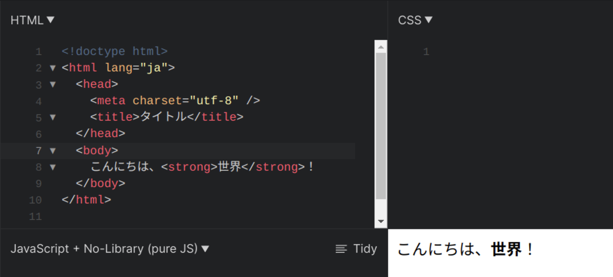
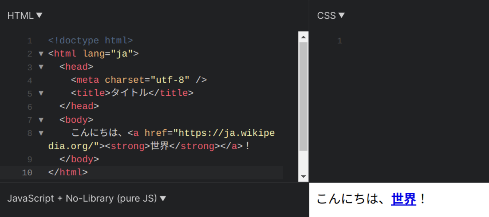

import openJsfiddleVideo from "./open-jsfiddle.mp4";
import writeHtmlCodeVideo from "./write-html-code.mp4";
import saveOnJsfiddleVideo from "./save-on-jsfiddle.mp4";

世の中には、数多くのウェブサイトがあります。
これらはどのようにして作られているのでしょうか。
実は、HTML と CSS、JavaScript の 3 つの言語を用いることで作ることができます。
これらの 3 つの言語は、互いに異なる役割をもっています。


HTML は、ウェブサイトの構造を表すことができます。
CSS は、色や配置などウェブサイトの見た目を変えることができます。
JavaScript は、ウェブサイトに動きを与えることができます。

まずは最も基本となる <Term>**HTML**</Term> から学んでいきましょう。

## はじめての HTML

まずは、<Term>HTML</Term> を用いて画面に `こんにちは、世界！` と表示してみましょう。

### JSFiddle を開く

この教材では、簡単に Web プログラミングを体験するために [JSFiddle](https://jsfiddle.net/) というオンライン上で使用できるコードエディターを使います。
[こちらのリンク](https://jsfiddle.net/)から JSFiddle にアクセスしてください。

<video src={openJsfiddleVideo} controls />

### JSFiddle で HTML のコードを書く

JSFiddle にアクセスすると画面左上に <Term>HTML</Term> のコードを書くことができます。
次のコードを JSFiddle に貼り付けてください。

```html
<!doctype html>
<html lang="ja">
  <head>
    <meta charset="utf-8" />
    <title>タイトル</title>
  </head>
  <body>
    こんにちは、世界！
  </body>
</html>
```

<video src={writeHtmlCodeVideo} controls />

### 結果を確認する

先ほど書いた <Term>HTML</Term> のコードを保存するために画面左上の `Save` というボタンを押してください。

`Save` ボタンを押して保存すると、画面右下に <Term>HTML</Term> のコードを実行した結果が表示されます。

`こんにちは、世界！` と表示されているはずです。

<video src={saveOnJsfiddleVideo} controls />

## HTML 要素

次に、先ほど書いた HTML のコードの `こんにちは、世界！` を次のように `こんにちは、<strong>世界</strong>！` に書き換えてみてください。

```html
<!doctype html>
<html lang="ja">
  <head>
    <meta charset="utf-8" />
    <title>タイトル</title>
  </head>
  <body>
    こんにちは、<strong>世界</strong>！
  </body>
</html>
```

保存すると、`こんにちは、世界！` の `世界` のみが強調して表示されるはずです。



`<strong>世界</strong>` の部分に注目してください。

HTML では、**タグ**というものを使うことで、文書に意味を持たせることができます。

`<tag>内容</tag>` のように記述した場合、`<tag>` を**開始タグ**、`</tag>` を**終了タグ**と呼びます。<Term>開始タグ</Term>から<Term>終了タグ</Term>までのまとまりを**要素**と呼びます。

{/* prettier-ignore */}
<Term>開始タグ</Term>と<Term>終了タグ</Term>の間には、テキストや別の<Term>要素</Term>を挟み込むことができます。

## HTML 属性

次に、先ほど書いた HTML のコードの `こんにちは、<strong>世界</strong>！` を次のように `こんにちは、<a href="https://ja.wikipedia.org/"><strong>世界</strong></a>！` に書き換えてみてください。

{/* prettier-ignore */}
```html
<!doctype html>
<html lang="ja">
  <head>
    <meta charset="utf-8" />
    <title>タイトル</title>
  </head>
  <body>
    こんにちは、<a href="https://ja.wikipedia.org/"><strong>世界</strong></a>！
  </body>
</html>
```

保存すると、`世界` が Wikipedia へのハイパーリンクになるはずです。



`<a href="https://ja.wikipedia.org/">～</a>` は `a` 要素です。
`a` 要素は、ハイパーリンクを作成します。

{/* prettier-ignore */}
<Term>開始タグ</Term>の中に `href="https://ja.wikipedia.org/"` という部分があります。
これが**属性**です。
<Term>属性</Term>は、<Term>開始タグ</Term>の中に `属性名="値"` のように記述され、<Term>要素</Term>の特徴を表します。
`a` <Term>要素</Term>の `href` <Term>属性</Term>は、ハイパーリンクのリンク先を表します。

この例では `a` 要素の中に `strong` 要素が含まれています。
このように、HTML 要素の中に他の HTML 要素を入れることで、効果を重ね掛けすることができます。

## HTML の文法

それでは、はじめの HTML のコードをもう一度見直してみましょう。

```html
<!doctype html>
<html lang="ja">
  <head>
    <meta charset="utf-8" />
    <title>タイトル</title>
  </head>
  <body>
    こんにちは、世界！
  </body>
</html>
```

1 行目にある `<!doctype html>` は、このファイルが HTML ファイルであるということを示しています。

2 行目の `<html lang="ja">` は、**`html` 要素**の<Term>開始タグ</Term>です。
すべての HTML 要素はこの<Term>要素</Term>の中に書かれます。

`html` 要素の中には、**`head` 要素**と **`body` 要素**の 2 つだけがあります。

`head` 要素は、その文書についての情報を表します。
`<meta charset="utf-8" />` により文字コードというものを指定しています。
`<title>タイトル</title>` によりその文書のタイトルを指定しています。

`body` 要素は、実際に画面に表示される情報を表します。
そのため、基本的には `body` 要素の内部を編集することになります。

:::tip[どうやって調べたらいいの？]

プログラミングを始めたての間は、分からないことがあったときにどのように調べたら良いのか戸惑うことが多いと思います。
そのようなときは、次のような手順で調べてみましょう。
例として、「文字を強調する方法」を調べてみることにします。

#### 1. タスクを細かく分割する

現在持ち合わせている知識をもとに、やりたいことを可能な限り細かく分割します。
今回の例であれば、HTML を使えば良いだろうと想像がつきます。

#### 2. Google で検索してみる

「HTML 強調」などと調べてみましょう。
課題が十分に細かく分割できていれば、これで直接的な回答が得られるはずです。
うまく答えが見つからない場合は、慣れている人に聞いてみてください。

#### 3. 周辺知識を信頼できる情報源で調べる

見つかったウェブサイトに掲載されているコードをもとに、信頼できる情報源を読みなおします。
HTML、CSS、JavaScript の場合は、[MDN](https://developer.mozilla.org/ja/) が便利でしょう。
例えば「HTML 強調」と調べて紹介されるのは `strong` <Term>要素</Term>なので、MDN でこの<Term>要素</Term>について調べておきましょう。

:::

## 演習問題

### 問題 1

次のように遠足の持ち物リストを作成してください。
お弁当は特に重要なので太字にしてください。


:::info[ヒント]

- 「遠足の持ち物」という見出しがあります。見出しを表現するには `h1` 要素を使います。`h1` 要素について調べてみてください。
- 箇条書きを表現するには、単に先頭に「・」と書くのではなく箇条書きを表現する要素を使います。`ul` 要素と `li` 要素について調べてみてください。

:::

<Answer title="遠足の持ち物リスト">

```html
<!doctype html>
<html lang="ja">
  <head>
    <meta charset="utf-8" />
    <title>遠足の持ち物リスト</title>
  </head>
  <body>
    <h1>遠足の持ち物</h1>
    <ul>
      <li><strong>お弁当</strong></li>
      <li>水筒</li>
      <li>タオル</li>
      <li>レジャーシート</li>
    </ul>
  </body>
</html>
```

<ViewSource url={import.meta.url} path="_samples/excursion" />

</Answer>
