## if 文

**if 文**を使うと、特定の条件の時だけ実行される処理を書くことができます。

次のプログラムを実行すると、`未成年です。` と表示されますが、1 行目を `let age = 18;` に変更すると何も表示されなくなります。

```javascript showLineNumbers
let age = 12;
if (age < 18) {
  document.write("未成年です。");
}
```

2 行目の `if (age < 18)` がポイントです。
`age < 18` は `true` になります。
if 文では、`(` と `)` で囲まれた部分が、`true` になると、`{` と `}` で囲まれた処理が実行されます。
このため、`未成年です。` が表示されたのです。

### 確認問題

学校で小テストがありました。

テストの点数を表す変数 `score` が用意されています。

点数が 80 点以上なら、`合格です。` と表示してください。

```javascript
let score = 85;
// ここにif文を書いてください。
```

<Answer title="小テスト">

```javascript
let score = 85;
if (score >= 80) {
  document.write("合格です。");
}
```

<ViewSource url={import.meta.url} path="_samples/quiz" />

</Answer>

## if ～ else 文

if ～ else 文を使うと、条件が満たされなかったときの処理を書くことができます。

次のプログラムを実行すると、`age` が `18` 未満の場合は `未成年です。` が表示されますが、`18` 以上の場合は `成年です。` が表示されます。

```javascript showLineNumbers
let age = 12;
if (age < 18) {
  document.write("未成年です。");
} else {
  document.write("成年です。");
}
```

`age < 18` の結果が `true` の場合は 3 行目が実行され、`false` の場合は 5 行目が実行されています。

## if ～ else if ～ else 文

if ～ else if ～ else 文を使うと、複雑な条件を表すことができます。

次のプログラムを実行すると、変数 `weather` が `晴れ` の場合は、`今日は晴れです。` と表示されます。
変数 `weather` が `晴れ` ではなく `雨` の場合は、`今日は雨です。傘を持ちましょう。` と表示されます。
変数 `weather` が `晴れ` でも `雨` でもない場合は、`天気がわかりません。` と表示されます。

```javascript
let weather = "晴れ";
if (weather === "晴れ") {
  document.write("今日は晴れです。");
} else if (weather === "雨") {
  document.write("今日は雨です。傘を持ちましょう。");
} else {
  document.write("天気がわかりません。");
}
```



## 演習問題

自分の年齢を表す変数 `age` が用意されています。

自分の年齢が 18 歳未満なら `選挙権はありません。` と表示して、18 歳以上 25 歳未満なら `投票に行けます。` と表示して、25 歳以上なら `衆議院議員に立候補できます。` と表示してください。

```javascript
let age = 12;
// ここにif～else if～else文を書いてください。
```

<Answer title="選挙権">

```javascript showLineNumbers
let age = 12;
if (age < 18) {
  document.write("選挙権はありません。");
} else if (age < 25) {
  document.write("投票に行けます。");
} else {
  document.write("衆議院議員に立候補できます。");
}
```

<ViewSource url={import.meta.url} path="_samples/voting-rights" />

4 行目は `age < 25` ではなく `18 <= age && age < 25` ではないかと思ったかもしれません。
しかし、`age < 25` と書くことも正しいです。
これは、`age < 18` が `true` になり 3 行目が実行された場合、4 行目は実行されないからです。

</Answer>
