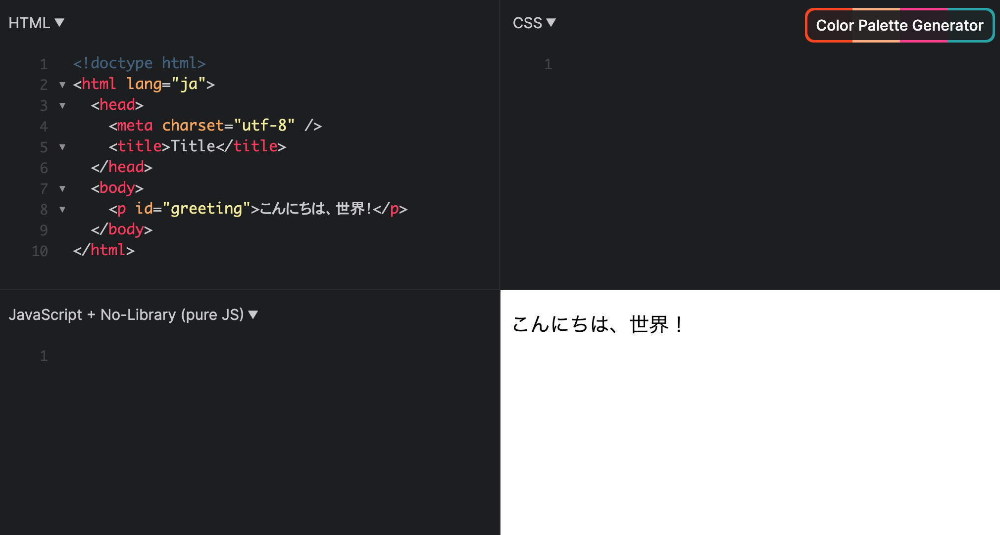
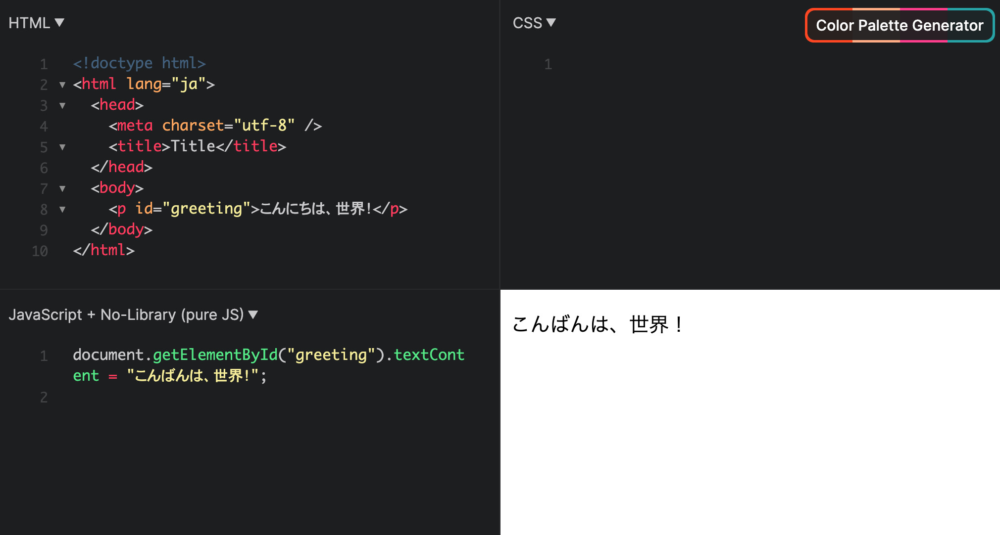
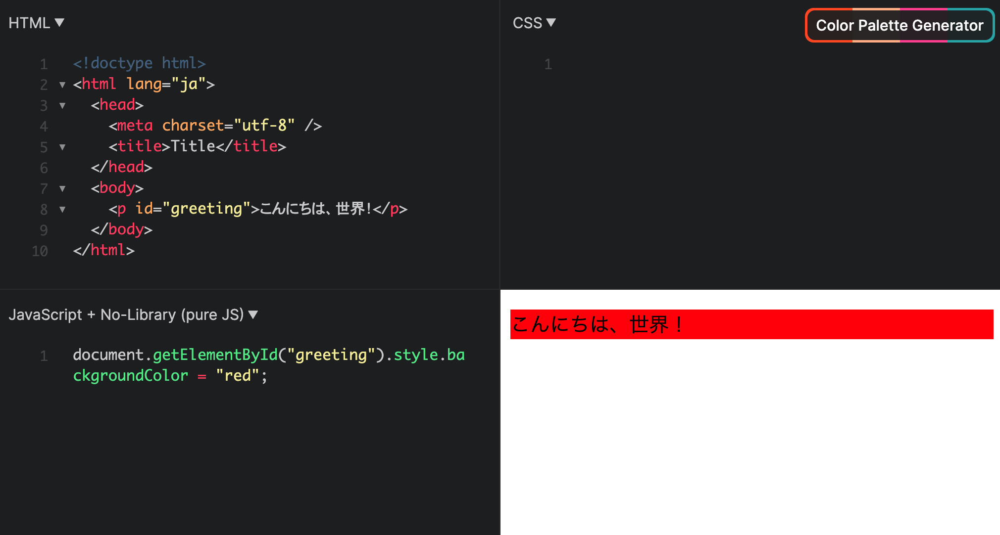

## JavaScript から HTML 要素を操作する

HTML の要素を JavaScript で直接操作することができます。

:::info[DOM]

このように HTML 要素を JavaScript などのプログラムから操作するための仕組みを **<Term>DOM</Term>** (Document Object Model) と呼びます。

:::

準備として、下のような HTML を用意しましょう。

```html title="HTML のプログラム"
<!doctype html>
<html lang="ja">
  <head>
    <meta charset="utf-8" />
    <title>タイトル</title>
  </head>
  <body>
    <p id="greeting">こんにちは、世界！</p>
  </body>
</html>
```

この HTML を保存してみると、`こんにちは、世界！` という文字が表示されます。
ここまでは今まで扱ってきた内容と同じです。



では、この ウェブサイトの HTML 要素を JavaScript を使って操作してみましょう。
下記の JavaScript のプログラムを書いて実行してください。

```js
document.getElementById("greeting").textContent = "こんばんは、世界！";
```

<ViewSource url={import.meta.url} path="_samples/get-element-by-id" />

すると、HTML のプログラムを書き換えていないのにもかかわらず、テキストが `こんばんは、世界！` に変わりました。



上記のプログラムの各部分について説明します。

- `document.getElementById("greeting")` の部分で、`id` 属性が `greeting` である要素を取得しています。
- `.textContent` と書くことで要素の中身のテキストにアクセスでき、テキストの取得や変更が行えます。ここでは `こんにちは、世界！` という文字列に変更しています。

### 確認問題

次のような HTML で作成されたウェブサイトがあります。

```html
<!doctype html>
<html lang="ja">
  <head>
    <meta charset="utf-8" />
    <title>ログインメッセージ</title>
  </head>
  <body>
    <p id="welcome-message">ようこそ！</p>
  </body>
</html>
```

JavaScript を使って、`ようこそ！` という部分を `こんにちは、田中さん！` に書き換えてください。

<Answer title="ウェルカムメッセージの書き換え">

```js
document.getElementById("welcome-message").textContent =
  "こんにちは、田中さん！";
```

<ViewSource url={import.meta.url} path="_samples/change-welcome-message" />

</Answer>

## JavaScript でスタイルを操作する

CSS の章で扱った「色」や「文字サイズ」などのスタイルも JavaScript から操作することができます。

下記のプログラムを実行してみましょう。

```html
<!doctype html>
<html lang="ja">
  <head>
    <meta charset="utf-8" />
    <title>タイトル</title>
  </head>
  <body>
    <p id="greeting">こんにちは、世界！</p>
  </body>
</html>
```

```js
document.getElementById("greeting").style.backgroundColor = "red";
```

<ViewSource url={import.meta.url} path="_samples/css" />

すると、背景色が赤色に変わりました。



- `document.getElementById("greeting")` で `id` 属性が `greeting` の要素を取得します。

- `.style.backgroundColor` と書くことで要素の背景色にアクセスでき、背景色の取得や変更が行えます。ここでは `"red"` (赤色) に変更しています。

この `backgroundColor` というフレーズに聞き覚えがないでしょうか。
そうです、CSS の章で背景色を変更する際に、`background-color` という<Term type="cssProperty">プロパティ</Term>を使いましたね。

これらはよく似ていますが、少し違う部分があります。
JavaScript では、ハイフン (`-`) で繋ぐ代わりに、2単語目以降の単語の先頭の文字を大文字にして `backgroundColor` として表す必要があるのです。

このように、CSS の<Term type="cssProperty">プロパティ</Term>に対応した書き方で、スタイルを JavaScript から操作することができます。

| スタイル   | CSS                | JavaScript        |
| ---------- | ------------------ | ----------------- |
| 背景色     | `background-color` | `backgroundColor` |
| 文字サイズ | `font-size`        | `fontSize`        |
| 文字色     | `color`            | `color`           |
| ……         | ……                 | ……                |

### 確認問題

次のような HTML で作成されたウェブサイトがあります。

```html
<!doctype html>
<html lang="ja">
  <head>
    <meta charset="utf-8" />
    <title>タイトル</title>
  </head>
  <body>
    <p id="greeting">こんにちは、世界！</p>
  </body>
</html>
```

JavaScript を使って、`こんにちは、世界！` の文字サイズを `40px` に変更してください。

<Answer title="文字サイズの変更">

```js
document.getElementById("greeting").style.fontSize = "40px";
```

<ViewSource url={import.meta.url} path="_samples/change-font-size" />

</Answer>

:::tip

`document.getElementById("greeting")` の部分を変数に入れて扱うこともできます。こうすると同じ要素に対する操作を簡潔に書くことができますね。

```js
let greetingElement = document.getElementById("greeting");

greetingElement.textContent = "こんばんは、世界！";
greetingElement.style.backgroundColor = "red";
```

:::

## 演習問題

次のような HTML で作成された買い物リストがあります。

```html
<!doctype html>
<html lang="ja">
  <head>
    <meta charset="utf-8" />
    <title>買い物リスト</title>
  </head>
  <body>
    <ul>
      <li id="item1">リンゴ</li>
      <li id="item2">レモン</li>
      <li id="item3">ブドウ</li>
    </ul>
  </body>
</html>
```


- この買い物リストを書き換えて、「リンゴ」「ミカン」「ブドウ」と表示されるようにしてみましょう。

- 「リンゴ」「ミカン」「ブドウ」の項目の色をそれぞれ `red`、`orange`、`purple` に変更しましょう。


<Answer title="買い物リストの書き換え">

```js
document.getElementById("item2").textContent = "ミカン";

document.getElementById("item1").style.color = "red";
document.getElementById("item2").style.color = "orange";
document.getElementById("item3").style.color = "purple";
```

<ViewSource url={import.meta.url} path="_samples/change-shopping-memo" />

</Answer>
